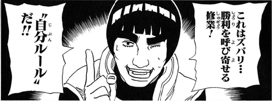

## はじめに

普段の開発で git のコミット単位やコミットメッセージを意識をしつつも仕組みとして決められていない、自分を含めてそんな人は多いのではないだろうか。
一人で開発してるとコミットを遡ることなんて滅多にないし、ここのコードよくわからないし書いた人に聞いてみるかーといったことも起こらないわけで。
勿論、見直して意味のないものを積み上げるのはよくないとわかっているものの適当なコミットを積み上げるのがやめられない。

そんな状況から脱却するため、せめて個人開発で好き勝手やるときくらいは自分でルールを決めてそれに従ってみるかと思い、そのための調査と最終的にどうするかを決める。

## Angular

commit メッセージの形式として有名なのは [Angular](https://angular.jp/) だろう。
Angular が最初にやり始めたのかは不明だが以下の形式は有名だ [要出展]。

```
<type>(<scope>): <short summary>
```

Angular のリポジトリにある DEVELOPMENT.md の [Commit Message Format](https://github.com/angular/angular/blob/main/CONTRIBUTING.md#-commit-message-format) により詳細な形式が記載されている。

Angular になる前の AngularJS と呼ばれていたころから少し形式が変わっているらしい。

## SemVer

git のコミットメッセージから話が逸れてしまうが、バージョニングの方法の一つとして[セマンティックバージョニング](https://semver.org/lang/ja/) (SemVer) と呼ばれるものがある。
これはよく見る `x.y.z` 形式のバージョンニングに関する仕様の一つであり、どのような変更が入ったときにどのバージョンをどのように上げるべきかが定められている。

SemVer ではバグ修正ではパッチバージョン z、機能追加ではマイナーバージョン y、後方互換性のない変更ではメジャーバージョン z を上げなければならない (MUST)。

では、次期バージョンをリリースするとき、以前のリリースと比べてバグ修正しかなかったのか、機能追加がされたのか、後方互換性を持たない変更が入ったのかどのように判断しているのだろうか。
多くのリポジトリでは、リリースする人が変更内容の履歴を確認してどのバージョンとしてリリースするか判断していると思われる。
やる気のあるリポジトリであれば、CIなどでメジャー、マイナー、パッチそれぞれでリリースタスクを作ってボタンをぽちぽちすれば設定ファイルのバージョンを定めた箇所の変更がコミットされ、成果物がよしなにアップロードされるようになっているだろう。

それでも判断は人が行っている。
正直なところ現代においてはプログラミング言語側である程度自動で検知する仕組みを提供して欲しいと思う。
勿論、厳密な判定は決定不能問題であるから不可能であるが、せめて I/F に基づくパッチ、マイナー、メジャーバージョンのチェックくらいはあってもいいのではないだろうか (一部の言語はもしかして提供されてる？)。

そんな機能は多くの言語で提供されていないため、少しでも楽にするためコミットメッセージにバグ修正なのか機能追加なのか、破壊的な変更が含まれているのか、を書くことで前回リリースバージョンからの差分のコミットメッセージを根拠に次期バージョンを決めれば半自動化できる！そんな考えを元に策定されたのが [Conventional Commits](https://www.conventionalcommits.org/ja/v1.0.0/) と呼ばれるコミットメッセージに関する仕様だ。

## Conventional Commit

[Conventional Commits](https://www.conventionalcommits.org/ja/v1.0.0/) の仕様は単純で、少し時間を確保すればその全容を知ることができる (SemVer については知っている前提)。
コミットメッセージの形式は Angular のコミットメッセージ形式が元になっている。

```
<type>[optional scope]: <description>

[optional body]

[optional footer(s)]
```

Conventional Commit の仕様として定められている `type` は `fix` と `feat` の二つだけだ。
それ以外の `type` については好きなものを使ってもいいことになっている。
SemVer との関係として、`fix`、`feat` がそれぞれ SemVer の `PATCH`、`MINOR` に対応する。
フッターに `BREAKING CHANGE: <description>` が含まれる、もしくは `<type>[optional scope]!` のように `!` が追加された場合が SemVer の `MAJOR` に対応する。

フッターには [git trailer format](https://git-scm.com/docs/git-interpret-trailers) に似た規約に従ったメッセージが追加される可能性があるらしい。
git trailer format は初めて知ったが `See-also:` が書かれたコミットメッセージは見たことがある。

さて、Conventional Commits に従う利点はいくつかある。

- 機械的な SemVer の割り当て
- CHANGELOG の自動生成
- 組織化されたコミット
  - type に従う必要があるため**従う努力をする限り**ある程度適切な単位でのコミットが強制される
- 理解しやすいコミット履歴
- コミットメッセージをトリガーとして CD の実行
- [各種ツール群](https://www.conventionalcommits.org/en/about/#tooling-for-conventional-commits)が使える

特に npm を始めとする JavaScript/TypeScript のパッケージマネージャを利用している場合は、多くのツールが利用できる。

## gitmoji

git のコミットメッセージに絵文字を使う習慣が世の中にはあったりなかったり。
コミットメッセージが華やかになる以外にぱっと身でどのような種類の変更がされたのかわかりやすくなるといったメリットがある [要出展]。

今回は贅沢に Conventional Commits に従うだけでなく絵文字もコミットメッセージに含める。
では、どの `<type>` にどの `emoji` を対応させるか、が問題になってくる。

git のコミット内容と絵文字の組合せを紹介した記事は「[git 絵文字](https://www.google.com/search?q=git+%E7%B5%B5%E6%96%87%E5%AD%97)」で検索すると沢山出てくるが、[gitmoji](https://gitmoji.dev/) がスタンダードみたいな顔してるし、これに従えばいいのでは？と思っているので長いものに巻かれて gitmoji から絵文字を選ぶことにする。

## 自分ルール



以上を踏まえて決めなればいけないことは多くない。

- `type`
- `optional`
- emoji
- 運用方法
  - ツール
  
### 形式

Conventional Commits をベースに `<description>` の前に `<emoji>` を入れることにする。

```
<type>[optional scope]: <emoji> <description>

[optional body]

[optional footer(s)]
```

### type

細分化しすぎている気もするがまずはこれで運用してみる。

| type     | emoji | 用法                         |
|----------|-------|------------------------------|
| fix      | 🐛    | バグ修正                     |
|          | 🩹    | 軽微な修正                   |
|          | ✏️     | typo の修正                  |
| feat     | ✨    | 機能追加                     |
| revert   | ⏪️    | Revert                       |
| refactor | ♻️     | リファクタリング             |
| perf     | ⚡️    | パフォーマンス改善           |
| style    | 🎨    | フォーマット                 |
| test     | ✅    | テスト追加                   |
| docs     | 📝    | ドキュメントの追加、更新     |
| ci       | 👷    | CIビルドシステムの追加、更新 |
|          | 💚    | CIビルドの修正               |
| build    | ➕    | 依存の追加                   |
|          | ⬆️     | 依存のアップレード           |
|          | ⬇️     | 依存のダウングレード         |
|          | 📌    | 依存を特定のバージョンで固定 |
|          | 🔧    | 設定ファイルの追加、更新     |
|          | 🔨    | ビルドスクリプトの追加、更新 |
| release  | 🔖    | リリース/バージョンタグ      |

### ツール

直近の関心としては Java でのプログラミングなので Gradle を中心に使えそうなツールを探す。
軽く調べた限りでは、ちょっとしたサポートはあるものの JS に比べると心許無く、これならば Java プロジェクトでも徐に `npm init` コマンドを打ち始めた方が有意義な気さえする。
最悪、自分でプラグインを作って満足行く環境を整える覚悟を決める必要がありそうだ。

## コミットメッセージに関する記事

- [Gitのコミットメッセージの書き方 - Qiita](https://qiita.com/itosho/items/9565c6ad2ffc24c09364)
  - [Gitのコミットメッセージの書き方 (2023年ver.) - Zenn](https://zenn.dev/itosho/articles/git-commit-message-2023)
- [僕が考える最強のコミットメッセージの書き方 - Qiita](https://qiita.com/konatsu_p/items/dfe199ebe3a7d2010b3e)
