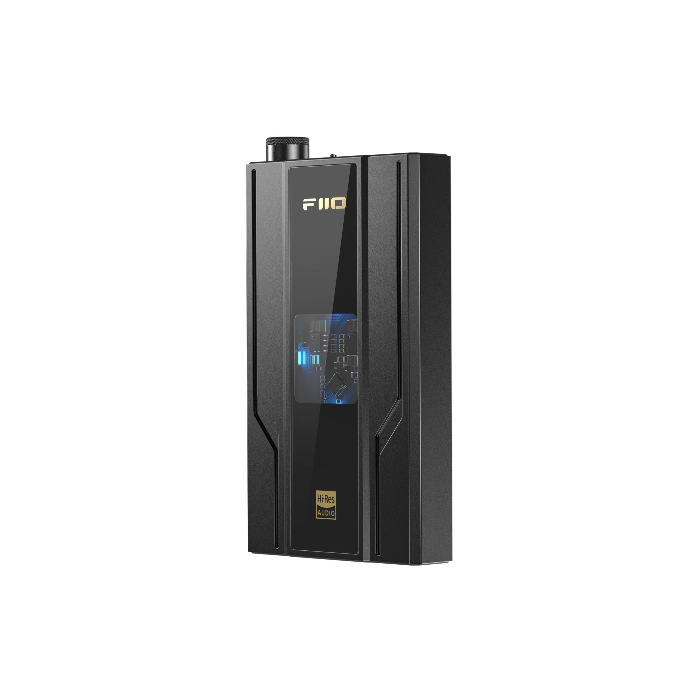

2023/02/10 に発売した [Fiio Q11](https://www.fiio.jp/products/q11/) を買ったのでレビュー記事を書いてみました。

Fiio Q11 は DAC 内蔵ポータブルヘッドホンアンプです。
商品の立ち位置としては [Fiio Q1 Mark II](https://www.fiio.jp/products/q1-mark2/) の後継機だと思います。
現在では既に販売されていないため、参考価格程度ですが 10,280 円で売られていたようで、Fiio Q11 の販売価格である 14,800 円と同価格帯と言っていいでしょう。
少しばかり値上げされていますが、円高が反映された結果だと思います :cry:。
Fiio は商品サイクルが早いため、欲しいと思ったときに購入しないとどんどん生産停止になっていきますね。

オーディオ関係も例に漏れず円高の影響を受けて、アンプに限らず各種商品が値上げされていて悲しくなってきます。

- [FiiO、Noble Audio、Benchmarkなどの製品が平均約10%値上げ - AV Watch](https://av.watch.impress.co.jp/docs/news/1402216.html)
- [エミライ、FiiOなど取り扱いブランド製品の価格改定を9/1より実施。平均約10%の値上げ - PHILE WEB](https://www.phileweb.com/news/d-av/202208/10/56134.html)
- [ソニー、AV製品を平均約14%値上げ。TV/サウンドバー/録画用BDなど - AV Watch](https://av.watch.impress.co.jp/docs/news/1473059.html)

Fiio Q11 も円高の影響がなければ Q1 Mark II と同じくらいの価格で販売されていたでしょう。

## 商品紹介

簡単に商品紹介します。

### 外観

公式ページから画像を拝借させてもらいますが、外観は以下のようになってます。

1万円台の商品となってすが安っぽささはあまり感じられませんが、高級感があるとも言えないでしょう。
表面は少しさらさらしており、指紋の付きにくい加工がされています。
全面のチップが見えるようになっている部分のパネルは指紋が付いてしまいます。

大きさは、最近のスマートフォンよりも小さく [WALKMAN A シリーズ](https://www.sony.jp/walkman/products/NW-A100_series/)より少しだけ大きいくらいです。

### 主な仕様

S/N 比や THD+N、ノイズフロア気にして買う人いる？
(数字だけ見てもわらないよ…)

| 項目                   | 仕様                                                                                                                                                                               |
|------------------------|------------------------------------------------------------------------------------------------------------------------------------------------------------------------------------|
| DACチップ              | CS43198                                                                                                                                                                            |
| 入力端子               | USB2.0 Type-C端子                                                                                                                                                                  |
| 出力端子               | 3.5mmシングルエンドヘッドホン/同軸デジタル出力兼用端子 4.4mmバランスヘッドホン出力端子                                                                                          |
| ヘッドホン出力         | 165mW（シングルエンドヘッドホン出力 / 32Ω負荷時 / THD+N<1%） 650mW（バランスヘッドホン出力/ 32Ω負荷時 / THD+N<1%） 75mW（バランスヘッドホン出力 / 300Ω負荷時 / THD+N<1%） |
| 対応サンプリングレート | 最高 PCM384kHz/32bit、DSD256                                                                                                                                                       |
| バッテリー容量         | 2600mAh                                                                                                                                                                            |
| 連続動作時間           | シングルエンド出力時：約13.5時間 バランス出力時：約13時間                                                                                                                       |
| 寸法                   | 105.7mm x 60.5mm x 16mm                                                                                                                                                            |
| 重量                   | 約150g                                                                                                                                                                             |

こうして見ると [Fiio Q7](https://www.fiio.jp/products/q7/) が如何にバケモノかが際立つ。

DACチップは Cirrus Logic 社製のフラッグシップ DAC チップ「CS43198」を搭載。
同 DAC を内蔵した製品としては、

- [Astell&Kern SR15](https://www.iriver.jp/products/product_171.php)
- [Astell&Kern PEE51](https://www.iriver.jp/products/product_211.php)
- [Moondrop MOONRIVER2](https://www.chikyu-sekai.com/?post_type=products&page_id=17644)
- [Topping D30Pro](https://www.tpdz.net/productinfo/590763.html)
- Jcally AP98
- ikkko ITM05 Music Pach

などがあるようだ。
Astell&Kern SR15 は巷では声DAPと呼ばれているらしい。

## 感想

### 試聴環境

#### 機器

比較に利用した機器は以下になります。

- ヘッドホン
  - [Focal Clear MG Pro](https://www.minet.jp/brand/focal/clear-mg-pro/)
  - [Sennhiser HD800S](https://www.sennheiser-hearing.com/ja-JP/p/hd-800-s/)
- DACアンプ/再生機器など
  - Fiio Q11
  - [TEAC UD-505](https://teac.jp/jp/product/ud-505/top)
    - [TEAC CG-10M](https://teac.jp/jp/product/cg-10m/top)
    - [Bluesound NODE](https://pdn.co.jp/bluesound/bs_node.html)
    - [audioquest Cinnamon 0.75m](https://dm-importaudio.jp/audioquest/lineup/detail1/index1385.html)
  - <s>[audio technica AT-HA26D](https://www.audio-technica.co.jp/product/AT-HA26D)</s>
    - 光デジタルケーブルが壊れていたため断念
    
Fiio Q11 は付属の USB Type-C to C ケーブルを使って iPad Pro と接続。

#### 楽曲

比較には手元にあるハイレゾ音源を利用しました。

- [One Last Kiss - 宇多田ヒカル](https://mora.jp/package/43000100/ESXX02331B00Z_96/)
- [結束バンド - 結束バンド](https://mora.jp/package/43000100/SVWC70613B00Z_48/)
- [けいおん!はいれぞ!「Come with Me!!」セット - 放課後ティータイム](https://mora.jp/package/43000004/PCSP-01969_F/)
- [THE BOOK - YOASOBI](https://mora.jp/package/43000011/4538182931066_HD/)
- [THE BOOK 2 - YOASOBI](https://mora.jp/package/43000011/4580789430497_HD/)
- [Donwload feat.初音ミク - ヴァリアス](https://mora.jp/package/43000174/825646170524_96/)

### ファーストインプレッション[^first-inpression]

**※この記事は個人の感想であり、商品の性能を示すものではありません。**

[^first-inpression]: 商品を開封して1日目に書いた感想です。エージング後に印象が変化した場合は追記予定です。

結論としては、音質は 1 万円台にしてはいいのではないでしょうか。
初めて購入したポータブルDACアンプなので比較対象が TEAC UD-505 になっているため中立の立場での評価はできないと思います。
TEAC UD-505 に比べるともの足りないですが、価格差を考えれば当然でしょう。
何かと比較なしに感想を書けるほどオーディオに詳しくないのご容赦ください。

また、最近の AV 機器の傾向なのだと思いますが、3.5mm アンバランス出力よりも 4.4mm バランス出力の方が音がいいように感じました。
UD-505 が 4.4mm バランス出力より 6.3mm アンバランス出力に重きを置いて作られている可能性がありますが、Fiio Q11 の 3.5mm アンバランスと TEAC UD-505 の 6.3mm アンバランス出力を比較したよりも 4.4mm バランス出力の差は大きくありませんでした。
逆に 3.5mm アンバランス出力は 4.4mm バランス出力と比べるとよくないように感じました。
これは、アンバランス・バランスの違い、最大出力の違いが音の違いとして現れたのでしょう。
利用するときは可能な限り 4.4mm バランス出力を使った方がいいように思いました。
しかし、この感想は誤っている可能性が高いです。
手元にバランス・アンバランスの両方を同じヘッドホンで試せる状況にないため、4.4mm は Sennhiser HD800S、3.5mm は Focal Clear MG Pro に基づいたものになってます。

出力端子による差異を除いた全体の感想としては、UD-505 と比べると一つ一つの音の輪郭や音の立ち上がり、空間表現がいまいちでした (これは全部なのでは…)。
始めにも書きましたが価格差があるのでそもそも比較するべきではないでしょう。
出力については、HD800S が聴くことができる音量で聴けているため多くのヘッドホンで問題ないと思われます。
しかし、音量が取れていることとヘッドホンの性能を引き出しつつ音量を確保できることは別だと思います。
ゲインをハイにして、iPad Pro 側の音量を 100% くらいまで上げた状態でツマミを2時くらいの位置に持っていくと大体の音が鳴らせているかな、というくらいの音量になります。
MAX まで持っていけばより大きな音は出ますが、音が割れて始めてしまい聴けたものではありません。
ヘッドホン外した後に耳がキーンとなるよな音量で音楽を聴く人でなければ、実用に足る程度には駆動できていると思います。
ただし、音量の調整はツマミが小さいというのもあり、思ったより細かい調整はできない印象です。

4.4mm バランス出力と 3.5mm アンバランス出力で感じたことがあまりにも違うので、改めてこの記事の執筆のため使われている DAC チップについて調べていたところ、CS43198 を搭載した Astell&Kern SR15 は前述の通り声 DAP と呼ばれており、中高音、女性ボーカルに焦点を当てた音作りがされていると書かれていた。
それを踏まえて曲を聴いてみると TEAC UD-505 に比べて低音が明らかに出ていない。
Focal Clear MG Pro は開放型ヘッドホンとしてはいい低音が出て厚みのある音を鳴らしてくれるのだが、Fiio Q11 ではその部分が失われているように感じた。
これは単純にヘッドホンとの相性がよくないということだろう。
その点、Sennhiser HD800S は低音は元からあまり出ない (相性のいいDAC/アンプに繋ぐと出るのかもしませんが…) ため、前述の欠点があまり現れず、TEAC UD-505 で聴いたときと差が 3.5mm アンバランス出力より小さく感じられたのかもしれません。

よくない感想ばかり書いていますが 14,800 円という価格を考慮すれば、ポータブル DAC 内蔵アンプの入門器としてはいいのではないでしょうか。
ヘッドホンを据え置きアンプに繋いだときの感動とは比較できませんが、有線ヘッドホンを買ったけどアンプ何それおいしいの？という人がとりあえず買うのにはお手頃価格だと思います
(外に限らず家の中で持ち歩くといった用途がないのであれば、据え置きを買うことをおすすめしますが…)。

Fiio Q11 の販売が発表されるまでは Fiio Q7 の購入を検討していましたが、初めての DAC 内蔵アンプでこの価格は本当に意味があるのか？という疑念が拭えず、Fiio Q11 の 14,800 円なら万が一使いものにならなくても外で有線で聴く音が改善するのであれば無駄にはならないだろう、くらいの気持ちで買いました。
その期待には答えてくれる出来になっていると思います。

手元にまともなポータブル DAP もポータブル DAC 内蔵アンプもないため、比較できませんでしたが本来は 3 万円台の DAP、1万円台の DAC 内蔵アンプと比較してコスパがいいか、が購入検討で大きな要素になってくると思います。
最近 Fiio が発売している製品の中では価格が安いためか YouTube でレビュー動画があまり上がってきていないですが、そのうちブログの記事やレビュー動画も上がってくるので、そちらを参考にするといいと思います。

## 注意点

注意が必要な点としては最近何かと耳にする [MQA](https://mqa.jp/) には対応していません。
そもそも一般の人で MQA で聴いている人に会ったことがないので購入を検討するときの要素に入ってくるのかは不明です。
FLAC、DSD でいいじゃん？って思いません。
CD に入ることにメリットを感じている層は実在するのでしょうか。

また、製品仕様からわかりますが Bluethooth レシーバのような機能は搭載されていないため、基本的に有線でスマートフォンに接続して利用することになります。
Bluethooth 接続で使いたい場合は、[Fiio BTR7](https://www.fiio.jp/products/btr7/) が候補になると思います。
こちらは Fiio Q11 に比べて出力が低いため、その点は注意しなければいけません。

すべての欲求を満すためには価格と重量を犠牲にして、[Fiio M17](https://www.fiio.jp/products/m17/) か [Fiio Q7](https://www.fiio.jp/products/q7/) を書くしかないでしょう。
金額に糸目を付けないのであれば [Astell&Kern SP3000](https://www.iriver.jp/products/product_228.php)！
オーディオ製品どのれも高すぎる。

## 今後

初めてポータブル DAC 内蔵アンプを購入しましたが、次にオーディオ機器はヘッドホンかヘッドホンアンプになるでしょう。
偶然、友人宅でヘッドホンを利用する用途があり、ヘッドホンを駆動させるため Fiio Q11 を購入しましたが、外でヘッドホンを使う機会はあまりないのです。

Focal が最近 Bluethooth ヘッドホンを[発表](https://av.watch.impress.co.jp/docs/news/1475501.html)したので、こちらは Clear MG Pro が好きな人間としては気になっており、こいつを購入した場合は Fiio Q11 を外で使う機会が増えるかもしれないです。
密閉型ヘッドホンで手元にあるのは [Sony HM-1000XM4](https://www.sony.jp/headphone/products/WH-1000XM4/) だけで、こいつは音がよくないので全くと言っていいほど使ってないです。
聴いていて楽しくないのが一番つらい。
外出するときは、外音が自然に聴こえるというメリットがある [LinkBuds](https://www.sony.jp/headphone/products/LinkBuds/) を使うくらいには Sony HM-1000XM4 は微妙だと思ってます。

購入を検討している中での本命は [iFi audio Pro iDSD Signature](https://ifi-audio.jp/pro/pro_idsd_signature.html) です。
桁が越えない価格で個人の趣味で買うならこの辺が限界かつ持っていても後悔はないもの、と自分に言い聞かせてます。
