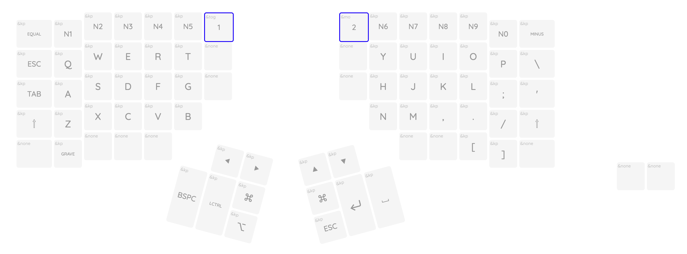

Kinesis Advantage が今年の2月21日に届いてから約2ヶ月が経過したので長期での利用を経てのレビューを書きます。

## 2ヶ月利用してみて

キーボードが届いた当日のレビューを読み返してみると文句を垂れている様子があったが、諸々を含めて Kinesis Advantage 360 に抱く感想としては、慣れさえすれば快適ということだ。
普段使っていた横長長方形のキーボードに比べると楽になる。
楽だと感じる要因を箇条書きにすると、

- 指を動かす距離が短い
- 慣れればキーの配置が左右にズレていなくても問題ない (寧ろ打ち易い)
- キーボードの配置はある程度慣れる
  - 数字はいつまでも遠い…
  - 一部の記号の打ち難さは今も感じる…
- 親指が使えるのはいいこと

が上げられる。

この手の人間工学に基づいた製品は、ある程度の期間利用しなければ良さが伝わらないのが難しい。
そして多くの場合は一般的な製品とは異なった形状をしているので、最初は抵抗を感じてしまい慣れ親しんだデバイスに戻る欲に負けて使わなくなってしまう。
そこを乗り越えるとその先に何かしらのメリットを享受することができる。
個人的には Kinesis Advantage 360 で得ることができたメリットは、**指を動かす距離が短い**こと、**小指の負担が軽減される**ことだと思う。
ちなみに今のところ**キー入力速度は退化**しました :smile:。指を動かす距離は短くなったのに…。

キー入力自体は1週間すれば慣れ始めて、2週間でほとんど違和感なく使えるようになった。

## 現在のキーバーインド

Kinesis Advantage 360 のキーコンフィグは GitHub を利用して行います。
設定方法は[この記事](https://qiita.com/acc1io/items/23b2a02f9210f2a3f22b)が参考になります。
GitHub で Kinesis 側がリポジトリを用意してくれているので、それをフォークして WebUI から好みの設定に変更し、GitHub Actions でファームウェアを書き出して USB 接続でキーボード本体に書き込むことでキーバインドを変更する。
そのため、フォークされたリポジトリを覗くことで他の人がどのようなバインドにしているのか見ることができる。

さて、私は現時点では以下のようなキーバインドに落ちついた。

親指以外のキーで変更した点としては、

- 左手で押す<kbd>Tab</kbd> と <kbd>ESC</kbd> を入れ換え
- 十字キーを潰す

くらいで他には手を加えていない。
親指については、

- Emacs を使う都合で
  - <kbd>Delete</kbd> の位置を <kbd>Control</kbd>
  - <kbd>Alt</kbd> と <kbd>Command</kbd> を左手の親指で押せる位置に
- 潰した十字キーを右と左の上に配置
- 左手の小指で <kbd>Esc</kbd> を押すよりも親指で押したかったので右手の親指に <kbd>Esc</kbd> を配置
- 特に配置したいものがなかったのでその上に <kbd>Command</kbd> を配置

にしている。左手の配置には Emacs で <kbd>Ctrl-</kbd>、<kbd>M-</kbd>、<kbd>s-</kbd> が親指に集約できており、特に <kbd>s-</kbd> をこれまで以上に活用できそうだ。
Emacs の設定を絶賛見直し中なのでこれからの話ではあるが…。

改善の余地はあると感じているので、Kinesis Advantage 360 ユーザの方でこの記事を読んでくださった方がいらっしゃれば、コメントでおすすめの配置を教えて欲しい。

## Emacs について

キーバインドで既に書いてしまったが、Emacs ユーザの左手の <kbd>Ctrl</kbd>、<kbd>Alt</kbd>、<kbd>Command</kbd> の配置は紹介した配列はおすすめできると思う。

最終的には Emacs の普通の配列で使うことにしたが、Kinesis Advantage 360 を使い始めたころは親指 <kbd>Ctrl</kbd> に違和感がありすぎて Spacemacs に逃げたが、Spacemacs でも結局 <kbd>Ctrl</kbd> を使っていたところ親指 <kbd>Ctrl</kbd> に慣れてしまい、Emacs を普通に使うのに戻ってきてしまった。
Emacs ユーザのしての体裁は何とか保てたか…?

Emacs のヘビーユーザは意外と Evil をカスタマイズして使っていたりしているので Vim のキーバインドに逃げても問題なんだろうけど…

## おわりに

- Kinesis Advantage 360 は**おすすめ**
- しばらく使い続けましょう
  - 公式も1~2週間かかると言ってる
- 販売再開は Twitter アカウントを監視しましょう
- Amazon Pay を設定しておくと争奪戦に勝てる可能性が高い
